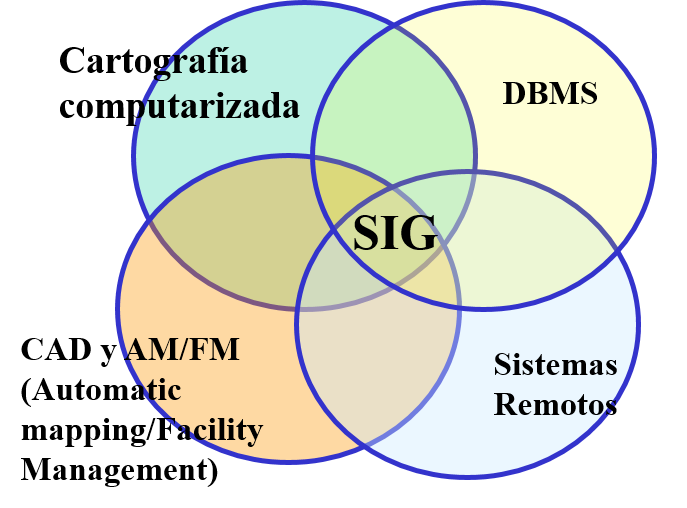

# Apuntes Sistemas de Informacion Geograficos

Por el momento super desordenado, refinar para estudiar de mejor manera

## Por que usar un sistema de info geografico?
La informacion que usamos dia a dia consta 70% de informacion geografica, un SIG es capaz de proveer respuestas sobre posicion, topologia, atributos sobre alguna consulta en especifica    

## Historia y problemas

Los fenicios hicieron los primeros vestigios de la cartografia, los griegos dieron saltos considerables a la forma de usarla. Manualmente surgieron los problemas de confiabilidad, perdida de mapas, lentitud en recuperacion de datos, dificil adapatacion (debido a escalas).
En los 60s con el computador a su lado tambien surgió la cartografia automatizada, en 1969 Lan Marchang publico un gran avance como el libro de Design with Nature lanza una técnica SCA (Análisis de Aptitud y capacidad de la tierra)

- En harvard 1964 se realiza los primeros prototipos con mapas simples con puntos y lineas
- Canada desarrolla CGIS por Roger Tomlinson: padre del sig. Formalmente el primer SIG con uso de DBMS

## Definicion de un sig

Es una coleccion organizada de Hardware, software y datos geograficos y personal asignado para la captura, almacenaje, actualizacion, manipuleo, analisis y despliegue de todas las formas de informacion referenciada geográficamente

## Partes de un SIG
1. Datos. Los cuales pueden ser mapas digitales o fisicos, constituyentes de puntos, lineas, areas y complejos
2. SIG. La pieza de software, constituida de un RDBMS y un analisador de los datos
3. Informacion. Datos de salida como esquemas, tablas, listas, mapas nuevos

## Operaciones Espaciales
Varios programas que pueden manejar conjuntos de datos, como ser coordenadas, no son considerados sig porque no pueden responder consultas espaciales. 

- Consulta espacial. Que se encuentra en esta coord(x,y), que pozos petroleros hay en el norte de SCZ
- Consulta no espacial. Cuantos pozos hay en bolivia, numero promedio de gente usa SIG en SCZ

## Union de datos - Emparejado borroso
Como se relacionan diferentes conjuntos de datos, un dbms usa **emparejado exacto**
Por jerarquia de datos es **Emparejamiento Jerarquico**

Un sig usa **Emparejado Borroso**, que relaciona los datos con referencias geograficas. Ej coord(x,y) en varias capas de **mapas**

## Preguntas que puede responder un sig

- Localizacion de un punto especifico
- Condicionales. Ej seccion deforestada < 2000m^2   
- Tendencia. Involucrando las pasadas encuentra la diferencia de un area con relacion al tiempo. Ej Tamaño del lago en 1950
- Patrones. Consulta sobre Anomalias a patrones normales. Ej muerte por cancer en area de Planta nuclear
- Modelamiento. Para realizar simulaciones. Ej adicionar un nuevo camindo a la red callejera, sustancia toxica en fuente de agua local

## Relaciones con otros sistemas de informacion

- Cartografia Digital. Provee los mapas vectoriales
- DBMS. Maneja los datos relacionales con datos no espaciales
- CAD y AM/FM. Computer aided design y Automatic mapping/Facility Management.
Un cad usa layers y sus componentes basicos son: Line, Circles and arcs, lines, symbols, text y otros. Estos están referenciados a un sistema de coordenadas (GRILLA).
- Sistemas Remotos. Se definen como tenica de adquisicion y procesamiento de datos para los sig, como ser satelites, drones, como producto las imagenes en formatos hertz, landsat, ikonos, etc. Raster images 

## Aplicaciones
**En Gobiernos**
- Planificación, zonificación, seguridad publica, valoración de tierras

**Administración de Recursos**
- Pesca y planificación de la fauna, agricultura
- Manejo de recursos minerales y energéticos
  
**Actividades diarias**
- Electricidad, agua, gas, petróleo, telecomunicaciones, TV cable

**Demografía**
- Análisis de mercado, Salud
  
**Educación**
- Universidades, laboratorios, bibliotecas, Institutos de investigación

## Componentes de un SIG

- Producto informativo. Salida del sig; mapas, informes, graficos
- Datos. Centro del SIG requiere un proceso costoso y exhaustivo para cumplir parametros y precision
- Software. Herramiento para alisis espacial y no espacial. Tiene 2 procesos: ingreso de datos y codificacion de atributos
- Hardware. Donde se ejecuta el sig
- Procedimientos. Politicas de negocio, plan y metodos de la empresa
- Recursos Humanos. Se necesitan humanos capaces como geografos, urbanistas, geologos, informaticos y otros 

## Como funciona?

Se estructura con diferentes capas que usan un sistema relativo, en este caso coordenadas, para enlazarse geograficamente. Los puntos de coords estan enlazados con una o mas bases de datos con un identificador

## Tareas de un SIG
### Entrada y verificacion de datos
- Entrada de datos espaciales. Con coordenadas, conversion de info, scanner, digitalizador manual y automatico
- Entrada de datos no espaciales. Entrada de texto al dbms
- Union de datos 

------------
# Apuntes de clase - Sistemas de Informacion Geográficos
**Clase 17/09/2025**
## Modelo de datos vector 

representa caracteristicas geograficas similares a los matas.
Usa: puntos, lineas, areas.
Cada posicion es registrada como una coord
usando puntos, lineas, areas

### punto
es solo un punto en las coords x,y

### Lineas 
es un conjunto de coords totalmente diferentes

### Poligono
Secuencia de coords donde la 1er y ultima coord se repiten

## Estructura de datos Arco-Nodo

no permite que existe la misma linea entre poligonos colisionando (ej: 2 cuadrados lado a lado)

3 conceptos
- conectividad. 
- contiguidad
- awa

## Modelo de raster

pixeles jijua

Vectorial es mejor para exactitud frfr