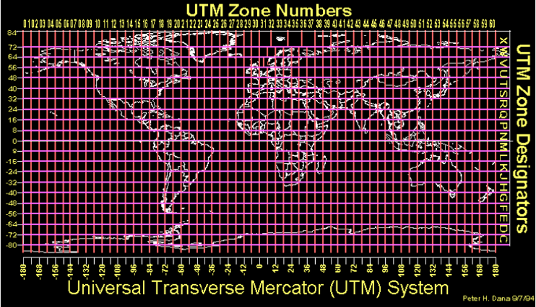
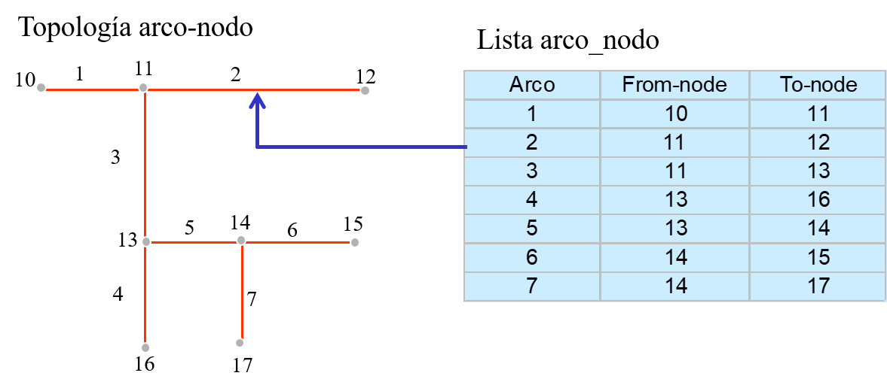
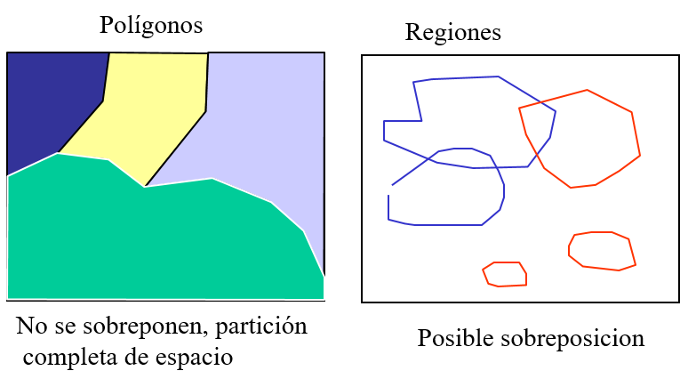
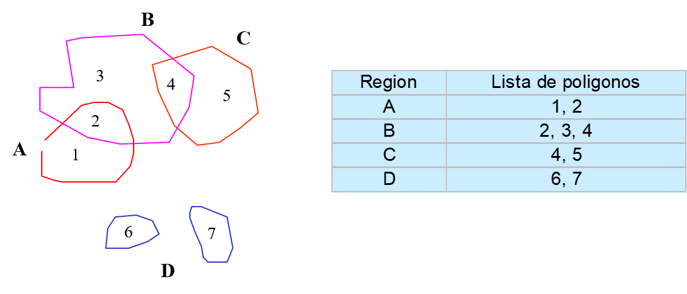
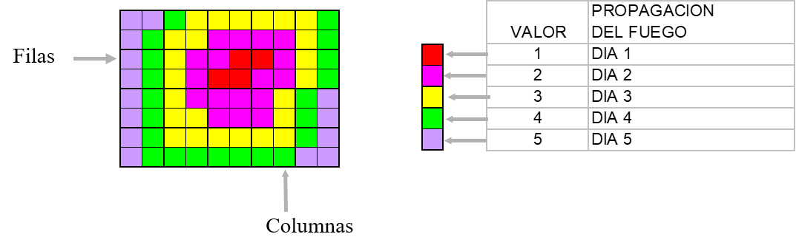

# Apuntes Sistemas de Informacion Geograficos

Por el momento super desordenado, refinar para estudiar de mejor manera

## Por que usar un sistema de info geografico?
La informacion que usamos dia a dia consta 70% de informacion geografica, un SIG es capaz de proveer respuestas sobre posicion, topologia, atributos sobre alguna consulta en especifica    

## Historia y problemas

Los fenicios hicieron los primeros vestigios de la cartografia, los griegos dieron saltos considerables a la forma de usarla. Manualmente surgieron los problemas de confiabilidad, perdida de mapas, lentitud en recuperacion de datos, dificil adapatacion (debido a escalas).
En los 60s con el computador a su lado tambien surgió la cartografia automatizada, en 1969 Lan Marchang publico un gran avance como el libro de Design with Nature lanza una técnica SCA (Análisis de Aptitud y capacidad de la tierra)

- En harvard 1964 se realiza los primeros prototipos con mapas simples con puntos y lineas
- Canada desarrolla CGIS por Roger Tomlinson: padre del sig. Formalmente el primer SIG con uso de DBMS

## Definicion de un sig

Es una coleccion organizada de Hardware, software y datos geograficos y personal asignado para la captura, almacenaje, actualizacion, manipuleo, analisis y despliegue de todas las formas de informacion referenciada geográficamente

## Partes de un SIG
1. Datos. Los cuales pueden ser mapas digitales o fisicos, constituyentes de puntos, lineas, areas y complejos
2. SIG. La pieza de software, constituida de un RDBMS y un analisador de los datos
3. Informacion. Datos de salida como esquemas, tablas, listas, mapas nuevos

## Operaciones Espaciales
Varios programas que pueden manejar conjuntos de datos, como ser coordenadas, no son considerados sig porque no pueden responder consultas espaciales. 

- Consulta espacial. Que se encuentra en esta coord(x,y), que pozos petroleros hay en el norte de SCZ
- Consulta no espacial. Cuantos pozos hay en bolivia, numero promedio de gente usa SIG en SCZ

## Union de datos - Emparejado borroso
Como se relacionan diferentes conjuntos de datos, un dbms usa **emparejado exacto**
Por jerarquia de datos es **Emparejamiento Jerarquico**

Un sig usa **Emparejado Borroso**, que relaciona los datos con referencias geograficas. Ej coord(x,y) en varias capas de **mapas**

## Preguntas que puede responder un sig

- Localizacion de un punto especifico
- Condicionales. Ej seccion deforestada < 2000m^2   
- Tendencia. Involucrando las pasadas encuentra la diferencia de un area con relacion al tiempo. Ej Tamaño del lago en 1950
- Patrones. Consulta sobre Anomalias a patrones normales. Ej muerte por cancer en area de Planta nuclear
- Modelamiento. Para realizar simulaciones. Ej adicionar un nuevo camindo a la red callejera, sustancia toxica en fuente de agua local

## Relaciones con otros sistemas de informacion

- Cartografia Digital. Provee los mapas vectoriales
- DBMS. Maneja los datos relacionales con datos no espaciales
- CAD y AM/FM. Computer aided design y Automatic mapping/Facility Management.
Un cad usa layers y sus componentes basicos son: Line, Circles and arcs, lines, symbols, text y otros. Estos están referenciados a un sistema de coordenadas (GRILLA).
- Sistemas Remotos. Se definen como tenica de adquisicion y procesamiento de datos para los sig, como ser satelites, drones, como producto las imagenes en formatos hertz, landsat, ikonos, etc. Raster images 

## Aplicaciones
**En Gobiernos**
- Planificación, zonificación, seguridad publica, valoración de tierras

**Administración de Recursos**
- Pesca y planificación de la fauna, agricultura
- Manejo de recursos minerales y energéticos
  
**Actividades diarias**
- Electricidad, agua, gas, petróleo, telecomunicaciones, TV cable

**Demografía**
- Análisis de mercado, Salud
  
**Educación**
- Universidades, laboratorios, bibliotecas, Institutos de investigación

## Componentes de un SIG

- Producto informativo. Salida del sig; mapas, informes, graficos
- Datos. Centro del SIG requiere un proceso costoso y exhaustivo para cumplir parametros y precision
- Software. Herramiento para alisis espacial y no espacial. Tiene 2 procesos: ingreso de datos y codificacion de atributos
- Hardware. Donde se ejecuta el sig
- Procedimientos. Politicas de negocio, plan y metodos de la empresa
- Recursos Humanos. Se necesitan humanos capaces como geografos, urbanistas, geologos, informaticos y otros 

## Como funciona?

Se estructura con diferentes capas que usan un sistema relativo, en este caso coordenadas, para enlazarse geograficamente. Los puntos de coords estan enlazados con una o mas bases de datos con un identificador

## Tareas de un SIG
### Entrada y verificacion de datos
- Entrada de datos espaciales. Con coordenadas, conversion de info, scanner, digitalizador manual y automatico
- Entrada de datos no espaciales. Entrada de texto al dbms
- Union de datos 
  
**Analisis de consultas**
- Especificacion geometrica. Determina un area y pide info sobre ella. Se pide toda o con una condición
- Especificación Descriptiva. Se recupera una base de datos de un area y se pide todos los atributos o con una condición

Las operaciones espaciales son Unión, intersección, identidad,, clip, erase , update pero
BUFFER es la mas remarcable consultando informacion dentro de un area puntual, como ser circulo lineas o poligono

## Conceptos de datos Geograficos
### Elementos básico que debe tener un mapa en papel
- Informacion espacial. Es la representación visual de **Objetos  geográficos** que esta al lado, forma, localizacion
- Información descriptiva. Es la **Descripción de los objetos**     

<!-- pagebreak -->

- Objetos Geograficos. Pueden ser:
  - objeto natural
  - construcciones
  - subdivisiones de la tierra

  Sus componentes son:
  - Gometria. Forma
  - Atritbutos. Descripcion como nombres
  - Comportamiento. Relacion con otros objetos

        
- Descripcion de objetos
  
- Escala
- Sistema de coordenadas
### Uso de un computador para manejar mapas:
- Información espacial
<!-- pagebreak -->

- Información descriptiva:
  Transmiten la informacion usando símbolos y etiquetas como ser:
    - Caminos son dibujados con varios anchos de línea colores para representar diferentes clases de caminos
    - Ríos y lagos son dibujados usando color azul para representar agua
    - El uso de Símbolos especiales denotan características especificas de un objeto geográfico.
    - Las Calles son etiquetadas con nombres
    - Las Construcciones especiales son etiquetados con sus nombres

Relaciones entre objetos son:

–Que característica geográfica conecta a otro
–Cual característica geográfica es adyacente a otro
–Cual característica geográfica esta contenida en un área
–Cual característica geográfica intercepta a otro
–Cual característica geográfica esta cerca de otro

## Escalas

sacar distancia real de 
- 6cm papel  
- escala: 1:2500000

Dr = 6cmpapel * (2500000cm real/1cmpapel)
Dr = 15000000cm real = 150000m real = 150km real

sacar distancia papel de
- 20km real
- escala: 1:50000

Dp = 2000000cmreal * (1cmpapel/50000cmreal)
Dp = 40cm papel

## Modelado de la superficie de la tierra
Un modelo es una reproducción de un objeto.  En geografía, el objeto es la superficie de la Tierra, que es tridimensional, grande y compleja. Y el modelo es el mapa.
    
- Se usa una representacion 2d, simplificante la 3d
- Se usa escalas para reducir el tamaño
- Se simplifica las caracteristicas de la superficie de la tierra

Geoide es la representacion sin irregularidades de la tierra
Elipsoide es la representación son representaciones tomando en cuenta el achatamiento

Una vez con elipsoide un metodo habitual para modelar los mapas es usando instrumentos topograficos relativas a un punto inicial. Este punto es **DATUM** y el elipsoide se ajusta a este

El Datum más reciente desarrollado es el Sistema Geodesico mundial de 1984 (WGS-84) y su sistema de aplicación el GPS. (Sistema de Posicionamiento Global)

También hay Datum locales, como ser PSAD56 (Provisional South American Datum de 1956) en la actualidad algunos mapas son manejados todavía con PSAD56

## Proyeccion

es el reto cartografico de representar en un mapa el elipsoide que es la tierra. Distintas proyecciones tratan de minimizar las deformaciones de adaptar una esfera a 2 dimensiones

**La proyección cartográfica**, desde el punto de vista del GIS, se entiende como una función que convierte las coordenadas geográficas (esféricas) en coordenadas cartesianas (métricas) con el fin de representar en un plano un objeto tridimensional.

### Tipos de Proyecciones

Según sus propiedades prevalecientes: 
- Proyecciones conformes (conformal en inglés): en las que los ángulos se conservan y, como consecuencia, las formas son parecidas a las reales. Ejemplos de proyecciones conformes son la UTM o la proyección Lambert.
- Proyecciones equivalentes (equal area en inglés): son aquéllas en las que la superficie se conserva después de la proyección. Como ejemplo de las proyecciones equivalentes tenemos las proyecciones Lambert Azimuthal Equal-Area, Bonne, Sinusoidal y la Goode.
- Proyecciones afilácticas: son aquellas en las que no se conservan ninguna de las variables, pero se minimizan sus deformaciones. Un ejemplo de este tipo de proyecciones es la UPS (Universal Polar Stereographics), que se usa en latitudes polares.

Segun la superficie 

- Las proyecciones cilíndricas; son efectivas para representar las áreas entre los trópicos     
- La proyecciones cónicas; sirven para representar áreas en latitudes medias.          
- Las proyecciones azimutales; sirven para representar zonas en altas latitudes.

### Sistemas de referencia
- Geodesico. 
  
Son mediciones del ángulo en grados del centro de la tierra a un punto sobre su superficie.
Latitud o paralelos es el ángulo medido de norte o sur del Ecuador, también llamado Paralelo.  Sus limites son: 0 a +90 grados norte y 0 a -90 grados sur

Longitud o Meridiano es medido del Este o Oeste del Meridiano primero (Greenwich). Sus limites son de 0 a +180 grados este y 0 a -180 grados oeste

- Proyectado. 
  
Nacen por lo complicado de los geosicos
El Sistema Coordinado cartesiano es el armazón
Las unidades de este sistema proyectado es el metro    

- Proyeccion UTM

UTM: Universal Transverse of Mercator
Es una versión especializada de la Transversa Mercator.
Esta proyección el globo terráqueo la divide en 60 fajas al Norte y al Sur de 6º de longitud cada una.
Cada faja tiene su propio meridiano central.  

## Representacion de informacion 
1. Modelo de datos vectorial (MDV)
2. Modelo de datos Raster (MDR)
3. Modelo TIN (Triangulated irregular network)

## Modelo de datos vectorial (MDV)

Usa elementos similares a los mapas 
- Puntos : Es registrado como una sola coordenada (x,y)
- Líneas : Son registrados como una serie de coordenadas (x,y)
- Areas: Son registrados como una serie de coordenadas (x,y) y definiendo segmentos que definen un área o polígono.

## TOPOLOGIA
Rama matematica que estudia relaciones espaciales
La estructura de datos Arco-Nodo soporta tres conceptos:

- Conectividad: Arcos conectan a cada uno de los nodos.
- Definición de área: Arcos que conectan alrededor de un área definen un polígono
- Contigüidad: Los arcos tiene dirección y lados derecho e izquierdo
 
### Conectividad**
Permite identificar una ruta al aeropuerto o Conectar arroyos con ríos

### Definicion de Area
Se define como un conjunto de Arcos cerrado. Esto es denominado **Topología Polígono-arco**

### Contiguidad
Dos objetos que comparten un limite se llaman adyacentes
Gracias al arco, con su estructura from-node to-node se define una direccion a la que apunta, con ello identifica los poligonos que estan a su izquierda o derecha

## EXTENSION DE MDV
### Regiones

A diferencia que los poligonos por si solos no pueden sobreponerse
Las regiones permite la sobreposicion e incluso separacion debido a que se **compone de poligonos**

### Rutas
Define caminos a lo largo de un conjunto existente de objetos geográficos lineales.

## Modelo de datos Raster MDR 
Son fotos compuestas de pixeles
Existen 3 formas de interpretar una foto:

- Clasificar cada punto como perteneciente a algún grupo de similares características
- Medir el valor de su color o sombra de grises
- Definir el pixel relativo a un punto de referencia conocida. Ej. Bajo el nivel del mar

La interpretacion de los pixeles puede dar distintos resultados despues de un analisis.
Se interpretan como una matriz

### Representacion de datos

- Una característica punto es representado como un valor en una sola celda

- Una característica lineal como una serie de celdas conectadas.

- Una característica de área como un grupo de celdas conectadas mostrando la forma

## MDV y MDR

Es capaz de usar ambos modelos con capas, activando una o la otra para distintos usos

Existe tambien la rasterizacion y vectorizacion

## Informacion descriptiva

Los atributos o información descriptiva asociados con objetos geográficos son almacenadas en el computador de una forma similar a como son almacenadas las coordenadas, en tablas.

### tabla de atributos

## Modelo georelacional
El poder de los sig es relacionar los datos descriptivos con los geograficos, con esto se define el modelo

Como se realiza el LINK (enlazamiento): 
- El único identificador de una característica asocia los atributos con las coordenadas de la característica
- Mantiene una correspondencia de uno-a-uno entre los registros espaciales y los registros atributos
- El único identificador es almacenado físicamente en dos lugares:
  - En los archivos conteniendo los X,Y
  - En la Tabla de atributos
- Una vez hecha la conexión , se puede desplegar la información de atributos o crear un mapa basado en esos atributos, utilizando los procesos Relate o Links vs Joqin
- Importante concepto relacional: Uno a muchos

------------
# Apuntes de clase - Sistemas de Informacion Geográficos

## Para el proyecto .net

Debemos ser capaces de poner un punto.
Con la libreria de sig verificar si el punto esta en la interseccion del area de cochabamba
para ello
1. Creamos un shape (capa) que contenga el punto
2. Realizar el query de cochabamba en un shape
3. Realizar la interseccion

4. Añadimos el mpaa de bolivia, con colores y weas
5. 