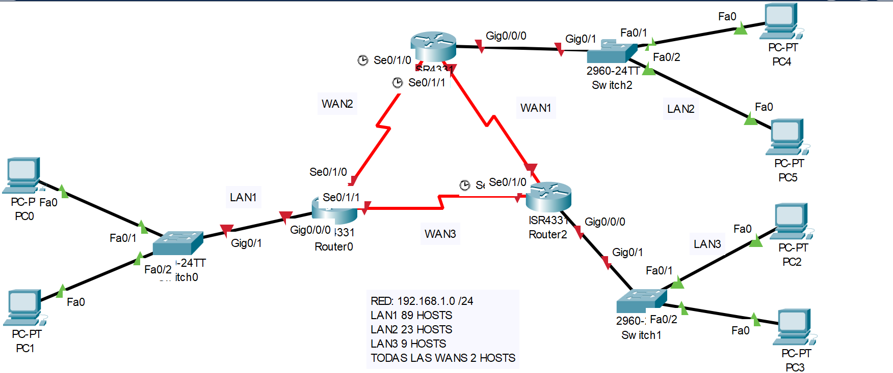
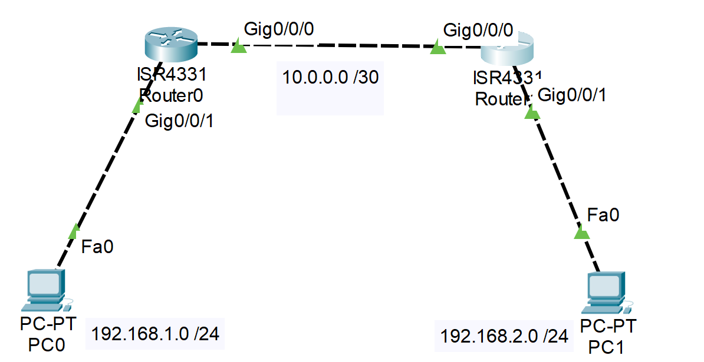
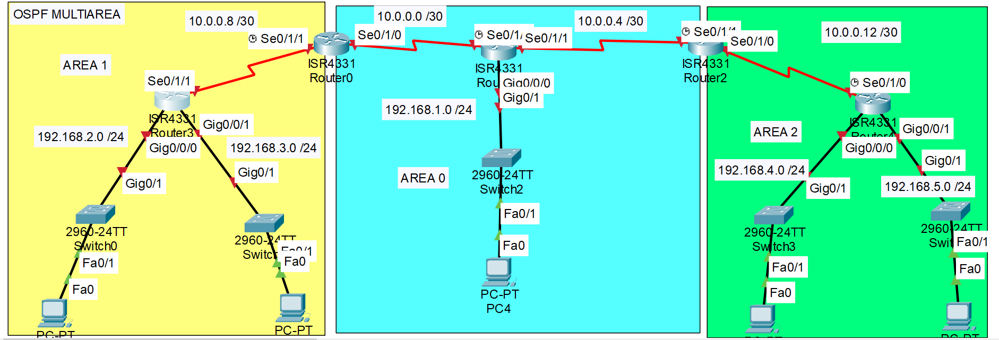
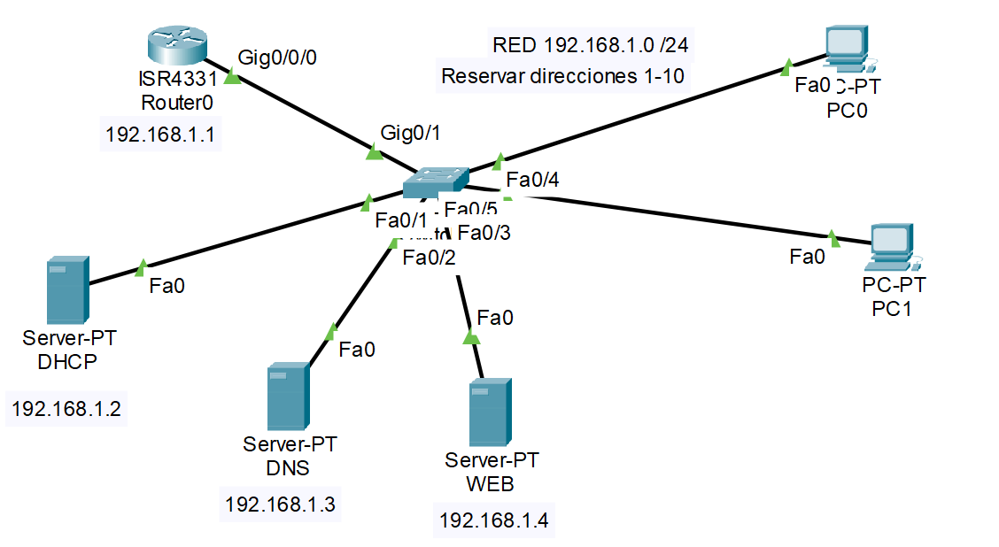
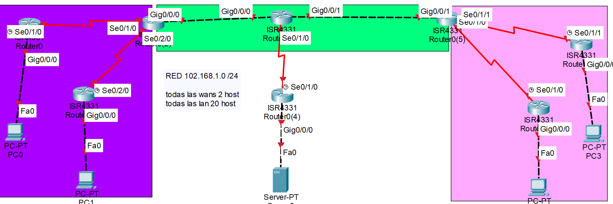

# SUBNETTING

*Dada la red 172.16.64.0 /18. Encontrar:*

1. 5000 hosts
2. 4000 hosts
3. 2000 hosts
4. 1000 hosts
5. 500 hosts
6. 256 hosts

| HOSTS | MASCARA           | D.RED        | D. BROADCAST   | RANGO                         |
| ----- | ----------------- | ------------ | -------------- | ----------------------------- |
| 5000  | /19 255.255.224.0 | 172.16.64.0  | 172.16.95.255  | 172.16.64.1  - 172.16.95.254  |
| 4000  | /20 255.255.240.0 | 172.16.96.0  | 172.16.111.255 | 172.16.96.1  - 172.16.111.254 |
| 2000  | /21 255.255.248.0 | 172.16.112.0 | 172.16.119.255 | 172.16.112.1 - 172.16.119.254 |
| 1000  | /22 255.255.252.0 | 172.16.120.0 | 172.16.123.255 | 172.16.120.1 - 172.16.123.254 |
| 500   | /23 255.255.254.0 | 172.16.124.0 | 172.16.125.255 | 172.16.124.1 - 172.16.125.254 |
| 256   | /23 255.255.254.0 | 172.16.125.0 | 172.16.126.255 | 172.16.125.1 - 172.16.126.254 |

-----------------

255.255.255.1111 1000

Ejercicio 2 - Subnetting

| HOSTS | MASCARA             | D.RED         | D. BROADCAST  | RANGO                         |
| ----- | ------------------- | ------------- | ------------- | ----------------------------- |
| 20    | /27 255.255.255.224 | 192.168.1.0   | 192.168.1.31  | 192.168.1.1  - 192.168.1.30   |
| 20    | /27 255.255.255.224 | 192.168.1.32  | 192.168.1.63  | 192.168.1.33 - 192.168.1.64   |
| 20    | /27 255.255.255.224 | 192.168.1.64  | 192.168.1.95  | 192.168.1.65 - 192.168.1.94   |
| 20    | /27 255.255.255.224 | 192.168.1.96  | 192.168.1.127 | 192.168.1.97 - 192.168.1.126  |
| 4     | /29 255.255.254.248 | 192.168.1.128 | 192.168.1.135 | 192.168.1.129 - 192.168.1.134 |
| 4     | /29 255.255.254.248 | 192.168.1.136 | 192.168.1.143 | 192.168.1.137 - 192.168.1.142 |
| 4     | /29 255.255.254.248 | 192.168.1.144 | 192.168.1.151 | 192.168.1.145 - 192.168.1.150 |
| 4     | /29 255.255.254.248 | 192.168.1.152 | 192.168.1.159 | 192.168.1.153 - 192.168.1.158 |


# Primera Topografias en Packet Tracer
##  Clase 5 - 29/08/2025 

### Factos

- Cable Directo: Para conectar dispositivos distintos; router - pc.
- Cable cruzado: para conectar dispositivos del mismo tipo como; router - router, pc - pc, etc.

### Comandos de Router

**Comandos de Config Terminal**

```
enable - entrar a modo priviligeado 
configure terminal - entrar a configuraciones globales
copy running-config startup-config - copiar las configuraciones actuales a las iniciales
write - guardar archivo de configuracion 
interface (nombre interfaz) - entrar a las configuraciones de una interfaz (puerto) 
```
-------------------
# Enrutamiento estatico
## Clase 03/09/2025

### Enrutamiento estatico basico

Para comunicacion fuera de una red, es necesario dar a el uso de router (enrutador), el cual se encarga de mostrar la ruta de viaje hacia otra red. El router necesita de configuraciones para cumplir el objetivo de comunicar 2 redes por lo que se hará una red bastante usando *Enrutamiento estatico*

Estatico es la forma mas basica de enrutamiento siendo que este no cambiará por su cuenta ni detectará las redes automaticamente, se hace manualmente toda la configuracion haciendolo bastante sencillo de realizar 

**Ejemplo**
Topografia:


Una vez conectados todos los dispositivos debemos primeramente configurar la red lan (Red Area Local). La parte izquierda seria una y la derecha otra
Trabajaremos en la LAN de la izquierda

**Ingresamos a la CLI del router:**

1. Pasamos a modo de configuracion global con los comandos

```
enable
configure terminal
```

2. Ingresamos a la configuracion de la interfaz (puerto) a la que esta conectada el switch, en este caso es la Gigabyte 0/0/1

```
interface gigabyte 0/0/1
```

3. Definimos la direccion de la red asignando una ip al router. Usando la red proveida y su Máscara
Ej. Si la direccion de la red debe ser 192.168.1.0 asignamos la ip 192.168.1.1 al router. Tomar en cuenta que estamos asignando la direccion a la interfaz (direccion del router dentro esta lan)

```
ip address 192.168.1.1 255.255.255.0
```

4. Configurar cada PC conectada a la LAN a través del switch de la siguiente manera:
   1. Ingresar a la PC
   2. Entrar a Desktop
   3. Entrar a configuracion de IP
   4. Asignar direccion IP
   5. Asignar Mascara de Subred
   6. En Gateway poner la direccion del router en la LAN
5. Realizar los pasos anteriores en las otras LANs
   
**Conexion entre redes (WAN)**
En esta etapa es donde usamos enrutamiento estatico para intercomunicar ambas redes. Esta comunicacion será otra red en totalidad a considerada como WAN
**Ingresamos al CLI de un router:**

1. Ingresamos a Configuracion global
2. Ingresamos a la interfaz de conexion con otro router. En este caso gigabyte 0/0/0

```
interface gigabyte 0/0/0
```

3. Asignamos la direccion del router en la WAN. Si la red wan debe tener la direccion 10.0.0.0 usar 10.0.0.1, ademas de usar la mascara necesaria

```
ip address 10.0.0.1 255.255.255.252
```

4. Realizar los pasos anteriores en el router vecino a conectar
5. En configuracion global, con enrutamiento estatico, declarar la red LAN a conectar a través del router vecino (dueño del otro LAN)

```
ip route 192.168.2.0 255.255.255.0 10.0.0.2
```

6. Realizar los pasos en los routers necesarios

## Clase 05/09/2025

Realizamos otro enrutamiento:

### Enrutamiento estatico con 3 Wans



Con la red proveida primero debemos subnettear para encontrar las ips para cada red

**Subnetting**

- RED: 192.168.1.0 /24
- Lan1 89 hosts
- Lan2 23 hosts
- Lan3 9 hosts
- todas las WANs 2 hosts


| HOSTS | MASCARA | D.RED | D. BROADCAST | RANGO |
| ----- | ------- | ----- | ------------ | ----- |
| 89    |         |       |              |       |
| 23    |         |       |              |       |
| 9     |         |       |              |       |
| 2     |         |       |              |       |
| 2     |         |       |              |       |


## Clase 12/09/2025
### Configuracion de credenciales de seguridad en el router

**El Ing mando estas directivas para una topologia de solo un router: **

CONFIGURACOINES BASICAS DE UN ROUTERS

NOMBRE DEL DISPOSITIVO
Router>enable
Router#configure terminal
Enter configuration commands, one per line.  End with CNTL/Z.
Router(config)#hostname R01
R01(config)#

GRABAR LAS CONFIGURACIONES
R01#copy running-config startup-config 
Destination filename [startup-config]? 
Building configuration...
[OK]

R01#write
Building configuration...
[OK]

R01#w
Building configuration...
[OK]

CONTRASEÑA PARA LA CONSOLA
```
R01(config)#line console 0
R01(config-line)#password ROBERTOCONSOLA
R01(config-line)#login
```

CONTRASEÑA PARA EL MODO PRIVILEGIADO
```
R01(config)#enable secret ROBERTOENABLE
```

DESACTIVA LA BUSQUEDA DE DNS
```
R01(config)#no ip domain-lookup
```

MENSAJE DE BIENVENIDA 
```
R01(config)#banner motd "INGRESO SOLO A PERSONAL AUTORIZADO"
```

ENCRIPTAR TODAS LAS CONTRASEÑAS
```
R01(config)#service password-encryption
```


HABILITAR SSH PARA PODER ADMINISTRA EL ROUTER REMOTAMENTE

CREAR UN USUARIO CON PRIVILEGIOS
```
R01(config)#username roberto privilege 15 secret ROBERTOSSH
```

HABILITAR EL DOMINIO, por acá se conectará el dispositivo a traves de ssh
```
R01(config)#ip domain-name cisco.com
```

HABILITAR LAS CLAVES CRIPTOGRAFICAS PARA RSA
```
R01(config)#crypto key generate rsa
```

CONFIGURAR SSH
```
R01(config)#ip ssh version 2
R01(config)#ip ssh time-out 120
R01(config)#ip ssh authentication-retries 3
```

CONFIGURAR LAS TERMINALES VIRTUALES Y HABILITAR SOLO SSH
```
R01(config)#lin vty 0 4
R01(config-line)#login loc 
R01(config-line)#transport input ssh
```
# Otros Protocolos
## Clase 15/09/2025. Teoria

### Clasificacion de protocolos de enrutamiento.

- Protocolos classful.
NO envian la mascara de subred durante las actualizaciones de enrutamiento entre ellos: RIP, IGRP.

- Protocolos classles.
Envia la mascara de subred durante las actualizaciones de enrutamiento.

**Convergencia.**
Se define como el estado en que las tablas de enrutamiento de todos los routers son uniformes, practicamente cuando toda la red es totalmente funcional.

### Metricas de los protocolos de enrutamiento.
Es un valor para medir el desempeño y eficiencia del enrutamiento.

**Metricas.**
- Ancho de banda.
- Costo.
- Retraso.
- Conteo de saltos.
- Carga Confiabilidad.


#### Balanceo de Carga.
Cuando 2 rutas tienen las mismas metricas, se divide el envio de datos para mayor velocidad.

#### Distancia admnistrativa de una ruta.


## Clase 17/09/2025

Otros protocolos y mas teoria

### Redistribucion

Acoplarse a una red antigua implica usar otros protocolos en los que ya esta configurado la red, para ello se usa la redistribución de ru enrutamiento

### Bucles de enrutamiento


# RIP
## Clase 26/09/2025

Mas Protocolos

### RIP
**Ripv1** ya no se usa 
**Ripv2**

maximo soporta 15 saltos


### Topografia de prueba


1. Hacemos las configuraciones basicas de ip
2. Una vez hecho entrar a las configuraciones de RIP, habilitar la version 2 y deshabilitar autosummary
```
Router(config)#router rip
Router(config-router)#version 2
Router(config-router)#no auto-summary
```
1. Declaramos las redes conectadas al Router. El protocolo se encarga de enrutar a los hosts 
```
Router(config-router)#network 10.0.0.0
Router(config-router)#network 192.168.1.0
```
1. Realizar lo mismo en el otro router
2. Ya ta o.o


## Clase 29/09/2025

Ya un enrutamiento grande para rip


| HOSTS | MASCARA             | D.RED      | D. BROADCAST | RANGO                  |
| ----- | ------------------- | ---------- | ------------ | ---------------------- |
| 2     | /30 255.255.255.252 | 10.0.0.0   | 10.0.0.3     | 10.0.0.1 - 10.0.0.2    |
| 2     | /30 255.255.255.252 | 10.0.0.4   | 10.0.0.7     | 10.0.0.5 - 10.0.0.6    |
| 2     | /30 255.255.255.252 | 10.0.0.8   | 10.0.0.11    | 10.0.0.9 - 10.0.0.10   |
| 2     | /30 255.255.255.252 | 10.0.0.12  | 10.0.0.15    | 10.0.0.13 - 10.0.0.14  |
| 2     | /30 255.255.255.252 | 10.0.0.16  | 10.0.0.19    | 10.0.0.17 - 10.0.0.18  |
| 2     | /30 255.255.255.252 | 10.0.0.20  | 10.0.0.23    | 10.0.0.21 - 10.0.0.22  |
| 100   | /25 255.255.255.128 | 10.0.0.24  | 10.0.0.151   | 10.0.0.25 - 10.0.0.150 |
| 100   | /25 255.255.255.128 | 10.0.0.152 | 10.0.1.23    | 10.0.0.153 - 10.0.1.22 |
| 100   | /25 255.255.255.128 | 10.0.1.24  | 10.0.1.151   | 10.0.1.25 - 10.0.1.150 |


# EGRP
## Clase 06/10/2025


## OSPF
## Clase 08/10/2025

**Enrutamiento demostracion**

entramos a las config de OSPF

```
Router(config)#router ospf 1
Router(config-router)#network 10.0.0.0 0.0.0.3 area 0
Router(config-router)#network 192.168.1.0 0.0.0.255 area 0
```


## Clase 10/10/2025
## OSPF multiarea




1. Hacemos las configs basicas de lan y wan
2. Hacemos el router principal de area 0
```
Router(config)#router ospf 1
Router(config-router)#network 192.168.1.0 0.0.0.255 area 0
Router(config-router)#network 10.0.0.0 0.0.0.3 area 0
Router(config-router)#network 10.0.0.4 0.0.0.3 area 0
```
3. Hacemos el router principal en el area 1
```
Router(config)#router ospf 1
Router(config-router)#network 10.0.0.8 0.0.0.3 area 1
Router(config-router)#network 192.168.3.0 0.0.0.255 area 1
Router(config-router)#network 192.168.2.0 0.0.0.255 area 1
```
4. Configuramos el router que esta entre el area 1 y el 0
```
Router(config)#router ospf 1
Router(config-router)#network 10.0.0.0 0.0.0.3 area 0
Router(config-router)#network 10.0.0.8 0.0.0.3 area 1

00:31:22: %OSPF-5-ADJCHG: Process 1, Nbr 192.168.1.1 on Serial0/1/0 from LOADING to FULL, Loading Done
00:32:05: %OSPF-5-ADJCHG: Process 1, Nbr 192.168.3.1 on Serial0/1/1 from LOADING to FULL, Loading Done
```
Los mensajes de Loading Done nos confirman que ospf encontró las redes publicadas

5. Configuracion del router de area 2
```
Router(config)#router ospf 1
Router(config-router)#network 10.0.0.12 0.0.0.3 area 2
Router(config-router)#network 192.168.4.0 0.0.0.255 area 2
Router(config-router)#network 192.168.5.0 0.0.0.255 area 2
```
6. Configuracion del router entre area 0 y 2
```
Router(config-router)#router ospf 1
Router(config-router)#network 10.0.0.4 0.0.0.3 area 0
Router(config-router)#network 10.0.0.12 0.0.0.3 area 2

00:37:22: %OSPF-5-ADJCHG: Process 1, Nbr 192.168.1.1 on Serial0/1/1 from LOADING to FULL, Loading Done
00:37:49: %OSPF-5-ADJCHG: Process 1, Nbr 192.168.5.1 on Serial0/1/0 from LOADING to FULL, Loading Done

```

# ACL
# DHCP

### clase 13/10/2025

1. Hacer la configuracion basica
2. Configurar DHCP en un router, este proveera las direcciones ip a la red
```
Router(config)#ip dhcp excluded-address 192.168.1.1
Router(config)#ip dhcp pool LAN1
Router(dhcp-config)#network 192.168.1.0 255.255.255.0
Router(dhcp-config)#default-router 192.168.1.1
Router(dhcp-config)#dns-server 8.8.8.8
Router(dhcp-config)#domain
Router(dhcp-config)#domain-name cisco.com
```
3.  Entramos a las computadoras conectadas a la red y Asignamos a cada una a que pida direccion ip con DHCP
4.  Para llegar a un router dhcp de otro, ingresar a la interfaz por donde llegaria la peticion y redireccionar al router dhcp con:
```
ip helper-address 10.0.0.1
```
5.  


# Servidores
### Clase 15/10/2025



Los servidores deben ser enrutados fijamente para que siempre comunicarse con ellos sin variabilidad
En el enrutamiento para los hosts debemos reservar esas direcciones, en caso de ospf excluyendo el rango necesario

**Servidor DHCP**
1. Primero conectar con el router como gateway
2. Asignar su direccion ip
3. En la pagina de configuraciones seguir con:
   1. En servicios activar dhcp
   2. Agregar el router principal como gateway y el servidor dns
   3. Crear un Pool de direcciones por cada subred necesaria
   4. añadir el pool y guardar las configs


**Servidor DNS**
1. Primero conectar con el router como gateway
2. Asignar su direccion ip
3. En la pagina de configuraciones seguir con:
   1. Activar dns en servicios
   2. Añadir los ips con su respectivo dominio

Todos los dispositivos que quieran usar dns tendran que ser proveidos en su configuracion, puede ser tanto estatico como proveido con DHCP

**WEB**

1. Primero conectar con el router como gateway
2. Asignar su direccion ip
3. En la pagina de configuraciones seguir con:
   1. Encender la funcion HTTPS, HTTP
   2. Configurar a gusto los archivos html


### Clase 22/10/2025

**PRACTICA**




1. Subnetting

| LAN  | Subred           | Máscara         | Dirección de red | Broadcast     | Rango de hosts                |
| ---- | ---------------- | --------------- | ---------------- | ------------- | ----------------------------- |
| LAN1 | 102.168.1.0/27   | 255.255.255.224 | 102.168.1.0      | 102.168.1.31  | 102.168.1.1 - 102.168.1.30    |
| LAN2 | 102.168.1.32/27  | 255.255.255.224 | 102.168.1.32     | 102.168.1.63  | 102.168.1.33 - 102.168.1.62   |
| LAN3 | 102.168.1.64/27  | 255.255.255.224 | 102.168.1.64     | 102.168.1.95  | 102.168.1.65 - 102.168.1.94   |
| LAN4 | 102.168.1.96/27  | 255.255.255.224 | 102.168.1.96     | 102.168.1.127 | 102.168.1.97 - 102.168.1.126  |
| LAN5 | 102.168.1.128/27 | 255.255.255.224 | 102.168.1.128    | 102.168.1.159 | 102.168.1.129 - 102.168.1.158 |


| WAN  | Subred           | Máscara         | Dirección de red | Broadcast     | Rango de hosts                |
| ---- | ---------------- | --------------- | ---------------- | ------------- | ----------------------------- |
| WAN1 | 102.168.1.160/30 | 255.255.255.252 | 102.168.1.160    | 102.168.1.163 | 102.168.1.161 - 102.168.1.162 |
| WAN2 | 102.168.1.164/30 | 255.255.255.252 | 102.168.1.164    | 102.168.1.167 | 102.168.1.165 - 102.168.1.166 |
| WAN3 | 102.168.1.168/30 | 255.255.255.252 | 102.168.1.168    | 102.168.1.171 | 102.168.1.169 - 102.168.1.170 |
| WAN4 | 102.168.1.172/30 | 255.255.255.252 | 102.168.1.172    | 102.168.1.175 | 102.168.1.173 - 102.168.1.174 |
| WAN5 | 102.168.1.176/30 | 255.255.255.252 | 102.168.1.176    | 102.168.1.179 | 102.168.1.177 - 102.168.1.178 |
| WAN6 | 102.168.1.180/30 | 255.255.255.252 | 102.168.1.180    | 102.168.1.183 | 102.168.1.181 - 102.168.1.182 |
| WAN7 | 102.168.1.184/30 | 255.255.255.252 | 102.168.1.184    | 102.168.1.187 | 102.168.1.185 - 102.168.1.186 |


2. Hacer las configuraciones locales de LAN y WAN
3. OSPF en AREA 0
   


Para practicar en lugar de hacer area 10 hacer rip
En lugar de area 20 hacer egrp
Area 0 osp
y estatico al server


## ACL

Sirve para bloquear la comunicacion desde ciertos origenes


ACL STANDAR
1. Las ACL estándar son aquellas que van numeradas entre el 1 al 99 y de 1300 a 1999
2. Las ACL estándar solamente pueden bloquear trafico basándose en la dirección ip de origen. Las ACL extendidas miran la ip de origen, la ip de destino, puertos de origen y destino.
3. Por norma general ACL estándar se configuran lo mas cerca posible del destino y las ACL extendidas lo mas cerca del destino.
4. Se puede escribir la palabra "host" para reemplazar una ip con wildcard 0.0.0.0 
5. Se puede escribir la palabra "any" para reemplazar una ip con wildcard 255.255.255.255
6. Todas las ACL llevan una regla implícita al final denominada "deny any" si es estándar y "deny ip any any" si es extendida.
7. Las ACL se ejecutan TOP-DOWN, o sea de arriba hacia abajo; es decir el ROUTER recorre cada una de las sentencias y ejecuta la primera con la que haya coincidencia "match", luego descarta las sucesivas.


```
R3(config)#access-list 1 permit 192.168.1.0 0.0.0.7
R3(config)#access-list 1 deny 192.168.1.0 0.0.0.255
R3(config)#access-list 1 permit any


R3(config)#int g0/0/0
R3(config-if)#ip access-group 1 out

```